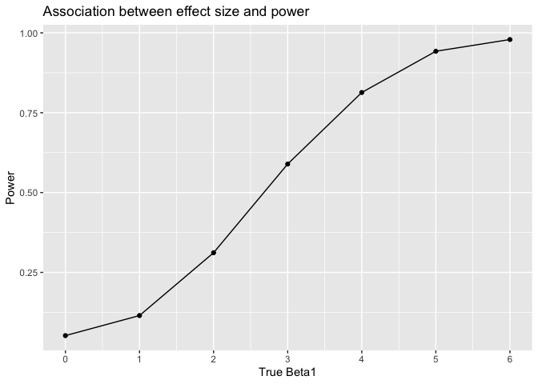

p8105\_hw5\_th2723
================
Tianhui He
2019/11/5

``` r
library(tidyverse)
```

    ## ── Attaching packages ────────────────────────────────────────── tidyverse 1.2.1 ──

    ## ✔ ggplot2 3.2.1     ✔ purrr   0.3.2
    ## ✔ tibble  2.1.3     ✔ dplyr   0.8.3
    ## ✔ tidyr   1.0.0     ✔ stringr 1.3.1
    ## ✔ readr   1.1.1     ✔ forcats 0.4.0

    ## ── Conflicts ───────────────────────────────────────────── tidyverse_conflicts() ──
    ## ✖ dplyr::filter() masks stats::filter()
    ## ✖ dplyr::lag()    masks stats::lag()

``` r
set.seed(10)

iris_with_missing = iris %>% 
  map_df(~replace(.x, sample(1:150, 20), NA)) %>%
  mutate(Species = as.character(Species)) %>% 
  janitor:: clean_names() 

view(iris_with_missing)
```

##### Problem 1

``` r
iris_with_missing_mean = function(x){
  if (is.numeric(x)){
    x = ifelse(is.na(x), mean(x, na.rm = TRUE), x)
  }
  else if(is.character(x)){
    x = ifelse(is.na(x), "virginica", x)
  }
}
iris_with_missing2 = map_df(.x = iris_with_missing, ~ iris_with_missing_mean(.x))
view(iris_with_missing2)
```

##### Problem 2

``` r
files = list.files(path = "./data")
data = data_frame(files = files) %>% 
    mutate(file_contents = map(files, ~read_csv(file.path("./data", .)))) %>%
  unnest() %>% 
pivot_longer(week_1:week_8, names_to = "week",
   values_to = "measurement") %>% 
  separate(files, sep = ".c", into = c("files", "remove")) %>% select(-remove) %>% 
  separate(files, into = c("group", "subject_id"), sep = "_") %>% 
  mutate(
    group = recode(group,
         `con` = "control",
         `exp` = "experimental")
    ) %>% 
mutate_all(~gsub("week_", "", .)) %>% 
mutate(week = as.numeric(week)) %>% 
mutate(measurement = as.numeric(measurement))
```

    ## Warning: `data_frame()` is deprecated, use `tibble()`.
    ## This warning is displayed once per session.

    ## Parsed with column specification:
    ## cols(
    ##   week_1 = col_double(),
    ##   week_2 = col_double(),
    ##   week_3 = col_double(),
    ##   week_4 = col_double(),
    ##   week_5 = col_double(),
    ##   week_6 = col_double(),
    ##   week_7 = col_double(),
    ##   week_8 = col_double()
    ## )
    ## Parsed with column specification:
    ## cols(
    ##   week_1 = col_double(),
    ##   week_2 = col_double(),
    ##   week_3 = col_double(),
    ##   week_4 = col_double(),
    ##   week_5 = col_double(),
    ##   week_6 = col_double(),
    ##   week_7 = col_double(),
    ##   week_8 = col_double()
    ## )
    ## Parsed with column specification:
    ## cols(
    ##   week_1 = col_double(),
    ##   week_2 = col_double(),
    ##   week_3 = col_double(),
    ##   week_4 = col_double(),
    ##   week_5 = col_double(),
    ##   week_6 = col_double(),
    ##   week_7 = col_double(),
    ##   week_8 = col_double()
    ## )
    ## Parsed with column specification:
    ## cols(
    ##   week_1 = col_double(),
    ##   week_2 = col_double(),
    ##   week_3 = col_double(),
    ##   week_4 = col_double(),
    ##   week_5 = col_double(),
    ##   week_6 = col_double(),
    ##   week_7 = col_double(),
    ##   week_8 = col_double()
    ## )
    ## Parsed with column specification:
    ## cols(
    ##   week_1 = col_double(),
    ##   week_2 = col_double(),
    ##   week_3 = col_double(),
    ##   week_4 = col_double(),
    ##   week_5 = col_double(),
    ##   week_6 = col_double(),
    ##   week_7 = col_double(),
    ##   week_8 = col_double()
    ## )
    ## Parsed with column specification:
    ## cols(
    ##   week_1 = col_double(),
    ##   week_2 = col_double(),
    ##   week_3 = col_double(),
    ##   week_4 = col_double(),
    ##   week_5 = col_double(),
    ##   week_6 = col_double(),
    ##   week_7 = col_double(),
    ##   week_8 = col_double()
    ## )
    ## Parsed with column specification:
    ## cols(
    ##   week_1 = col_double(),
    ##   week_2 = col_double(),
    ##   week_3 = col_double(),
    ##   week_4 = col_double(),
    ##   week_5 = col_double(),
    ##   week_6 = col_double(),
    ##   week_7 = col_double(),
    ##   week_8 = col_double()
    ## )
    ## Parsed with column specification:
    ## cols(
    ##   week_1 = col_double(),
    ##   week_2 = col_double(),
    ##   week_3 = col_double(),
    ##   week_4 = col_double(),
    ##   week_5 = col_double(),
    ##   week_6 = col_double(),
    ##   week_7 = col_double(),
    ##   week_8 = col_double()
    ## )
    ## Parsed with column specification:
    ## cols(
    ##   week_1 = col_double(),
    ##   week_2 = col_double(),
    ##   week_3 = col_double(),
    ##   week_4 = col_double(),
    ##   week_5 = col_double(),
    ##   week_6 = col_double(),
    ##   week_7 = col_double(),
    ##   week_8 = col_double()
    ## )
    ## Parsed with column specification:
    ## cols(
    ##   week_1 = col_double(),
    ##   week_2 = col_double(),
    ##   week_3 = col_double(),
    ##   week_4 = col_double(),
    ##   week_5 = col_double(),
    ##   week_6 = col_double(),
    ##   week_7 = col_double(),
    ##   week_8 = col_double()
    ## )
    ## Parsed with column specification:
    ## cols(
    ##   week_1 = col_double(),
    ##   week_2 = col_double(),
    ##   week_3 = col_double(),
    ##   week_4 = col_double(),
    ##   week_5 = col_double(),
    ##   week_6 = col_double(),
    ##   week_7 = col_double(),
    ##   week_8 = col_double()
    ## )
    ## Parsed with column specification:
    ## cols(
    ##   week_1 = col_double(),
    ##   week_2 = col_double(),
    ##   week_3 = col_double(),
    ##   week_4 = col_double(),
    ##   week_5 = col_double(),
    ##   week_6 = col_double(),
    ##   week_7 = col_double(),
    ##   week_8 = col_double()
    ## )
    ## Parsed with column specification:
    ## cols(
    ##   week_1 = col_double(),
    ##   week_2 = col_double(),
    ##   week_3 = col_double(),
    ##   week_4 = col_double(),
    ##   week_5 = col_double(),
    ##   week_6 = col_double(),
    ##   week_7 = col_double(),
    ##   week_8 = col_double()
    ## )

    ## Parsed with column specification:
    ## cols(
    ##   week_1 = col_double(),
    ##   week_2 = col_double(),
    ##   week_3 = col_double(),
    ##   week_4 = col_double(),
    ##   week_5 = col_double(),
    ##   week_6 = col_double(),
    ##   week_7 = col_integer(),
    ##   week_8 = col_double()
    ## )

    ## Parsed with column specification:
    ## cols(
    ##   week_1 = col_double(),
    ##   week_2 = col_double(),
    ##   week_3 = col_double(),
    ##   week_4 = col_double(),
    ##   week_5 = col_double(),
    ##   week_6 = col_double(),
    ##   week_7 = col_double(),
    ##   week_8 = col_double()
    ## )
    ## Parsed with column specification:
    ## cols(
    ##   week_1 = col_double(),
    ##   week_2 = col_double(),
    ##   week_3 = col_double(),
    ##   week_4 = col_double(),
    ##   week_5 = col_double(),
    ##   week_6 = col_double(),
    ##   week_7 = col_double(),
    ##   week_8 = col_double()
    ## )
    ## Parsed with column specification:
    ## cols(
    ##   week_1 = col_double(),
    ##   week_2 = col_double(),
    ##   week_3 = col_double(),
    ##   week_4 = col_double(),
    ##   week_5 = col_double(),
    ##   week_6 = col_double(),
    ##   week_7 = col_double(),
    ##   week_8 = col_double()
    ## )
    ## Parsed with column specification:
    ## cols(
    ##   week_1 = col_double(),
    ##   week_2 = col_double(),
    ##   week_3 = col_double(),
    ##   week_4 = col_double(),
    ##   week_5 = col_double(),
    ##   week_6 = col_double(),
    ##   week_7 = col_double(),
    ##   week_8 = col_double()
    ## )
    ## Parsed with column specification:
    ## cols(
    ##   week_1 = col_double(),
    ##   week_2 = col_double(),
    ##   week_3 = col_double(),
    ##   week_4 = col_double(),
    ##   week_5 = col_double(),
    ##   week_6 = col_double(),
    ##   week_7 = col_double(),
    ##   week_8 = col_double()
    ## )
    ## Parsed with column specification:
    ## cols(
    ##   week_1 = col_double(),
    ##   week_2 = col_double(),
    ##   week_3 = col_double(),
    ##   week_4 = col_double(),
    ##   week_5 = col_double(),
    ##   week_6 = col_double(),
    ##   week_7 = col_double(),
    ##   week_8 = col_double()
    ## )

    ## Warning: `cols` is now required.
    ## Please use `cols = c(file_contents)`

``` r
data %>%
  ggplot(aes(x = week, y = measurement , color = group, group = subject_id)) + 
  geom_path() 
```

 \#\#\#\#\#Problem3

``` r
library(broom)
linear_regression = function (n, beta0 = 2, beta1) {
  
  regression_data = tibble(
    x = rnorm(n, mean = 0, sd = 1),
    y = beta0 + beta1 * x + rnorm(n, 0, sqrt(50))
  )
ls_fit = lm(y ~ x, data = regression_data)

tibble(
    beta1_hat = coef(ls_fit)[[2]],
    pvalue = broom::tidy(ls_fit)$p.value[[2]]
  )
}

output = vector("list", 10000)

for (i in 1:10000) {
  output[[i]] = linear_regression(n = 30, beta1 = 0)
}

sim_result = bind_rows(output)
#view(sim_result)
```

### repeat the same process for beta1 = 1,2,3,4,5,6

``` r
outputs = vector("list", 6)
for (i in 1:6){
  outputs[[i]] = vector("list", 10000)
  for (j in 1:10000){
    outputs[[i]][[j]] = linear_regression(n=30,beta1 = i)
  }
}
sim_results = vector("list", 6)
for (i in 1:6){
  sim_results[[i]] = bind_rows(outputs[[i]])
}

#view(sim_results)
```

plots
=====

``` r
number_pvalue = function(x) {
  temp = 
  x %>% 
  filter(pvalue <= 0.05) %>% 
  mutate(
    total = n()
  ) %>%
  select(total) %>%
  distinct()
  
  temp$total/10000
}
tempList = vector("list", 7)
tempList[[1]] = number_pvalue(sim_result)
for (i in 1:6) {
  tempList[[i+1]] = number_pvalue(sim_results[[i]])
}
#view(tempList)

simulation_result = 
  tibble(betal1s = c(0:6),
         proportion = c(tempList[[1]],tempList[[2]],tempList[[3]],tempList[[4]],tempList[[5]],tempList[[6]],tempList[[7]]))

simulation_result = as.data.frame(simulation_result)
simulation_result = simulation_result %>%
  mutate(betal1s = as.numeric(betal1s))
#view(simulation_result)


simulation_result %>%
  ggplot(aes(x=betal1s, y = proportion)) +
  geom_point() +
  geom_line()+
  scale_x_continuous(breaks = seq(0, 6, by=1)) +
  labs(
    x = "True Beta1", y = "Power",
    title = "Association between effect size and power",
    caption = "Simulation iterations: 10000"
  )
```


